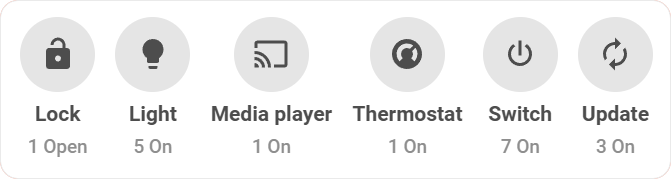
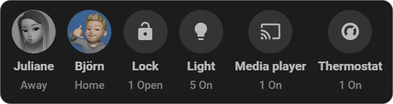

# Status Card

**Status Card** is a custom card for Home Assistant dashboards that automatically
builds an overview of your areas – active entities only, neatly grouped by domain or
device class, with interactive detail popups.

The card reads the devices and entities you have assigned to your Home Assistant
areas and shows them right away: no daily tweaking and no manual card setup. Just
assign your devices to areas and let the card handle the rest.

!!! info "Main requirement"
    The card is based on your Home Assistant areas. Assign your relevant devices
    and entities to their **areas** beforehand for the card to work.

  
&nbsp;
  

## Features

- 🪄 **Zero-configuration magic** – automatically built from the entities and devices
  assigned to your areas.
- 🔎 **Smart state filtering** – shows only active or "on" entities, with optional
  inverted logic for custom use cases.
- 🧩 **Dynamic grouping** – organizes active entities by their `domain` or
  `device_class`.
- 🧠 **Powerful smart groups** – multi-layered filters by state, domain and more.
- ➕ **Extra & ignored entities** – add missing entities manually or hide specific
  ones you don't want to see.
- 💬 **Interactive detail popups** – tap any group to open a popup rendering the
  entities as interactive Tile Cards.
- 📱 **Fully responsive** – optimized layouts for desktop, tablet and mobile.
- 🌍 **Native localization** – translates into all Home Assistant languages.

## Next steps

- [Installation](installation.md)
- [Configuration](config.md)
- [Customization](customization/index.md)
- [FAQ](faq.md)
- [Projects](projects.md)
